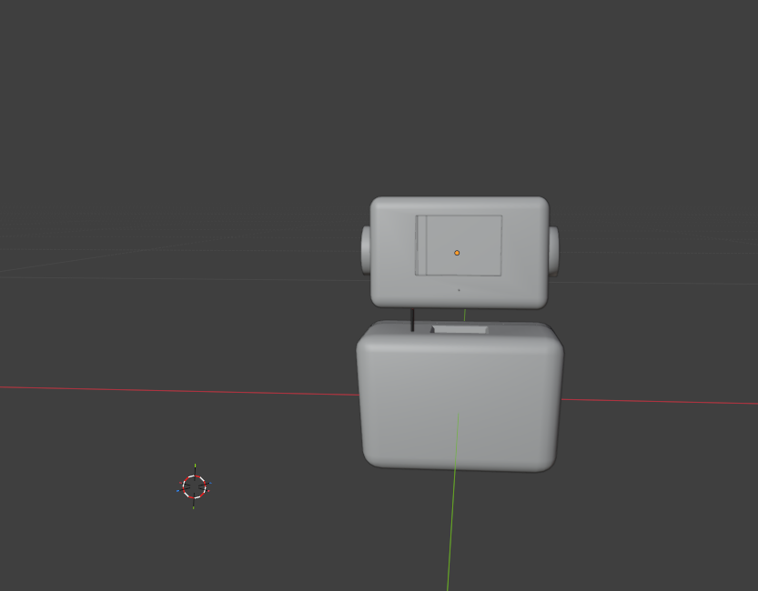
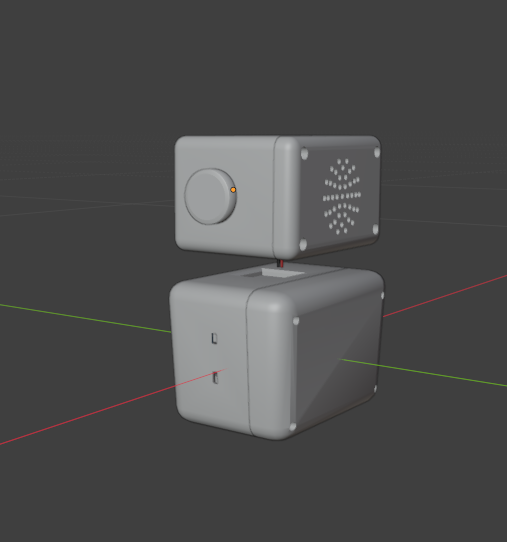
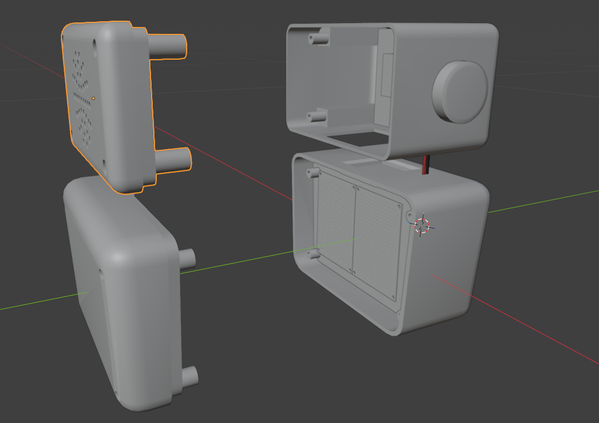

# 🤖 NOVA Robot

NOVA is a desktop IoT robot project that I am currently developing.

The robot's body and enclosure are being designed in Blender with the physical hardware and 3D-printing process in mind.

## Project Focus

* 3D modeling
* Hard-surface modeling
* Robot enclosure design
* Component placement
* Screw boss and mounting design
* Display mounting
* Designing parts for 3D printing

## Current Progress

The NOVA body is currently being developed and refined.

The model has been designed around the project's electronic components and physical assembly requirements. The final body has **not been 3D printed yet**.

## Hardware Integration

The Blender design is being developed alongside the electronics so that components can be properly positioned inside the robot enclosure.

## Software

* Blender
* Cura
* Arduino IDE

## Status

🟡 **Work in Progress — Not Yet Printed**

## Preview

Current views of the NOVA robot design.

The model will continue to be refined before the final parts are prepared for 3D printing.

## Note

The Blender source files are not publicly available. This repository contains preview images of the project for portfolio purposes.
