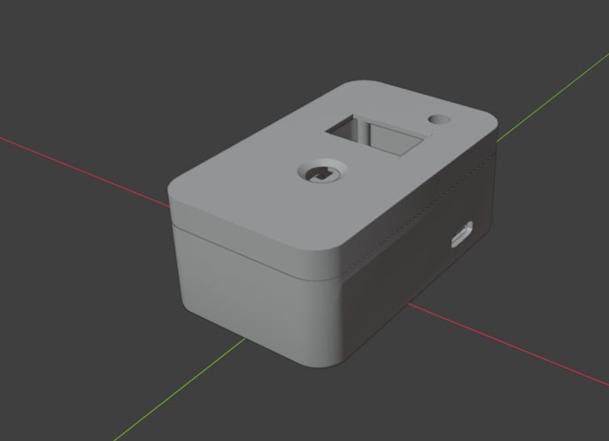
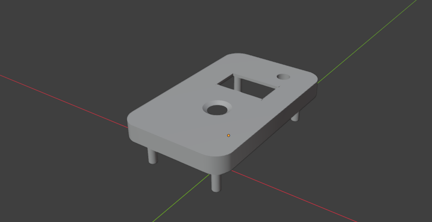
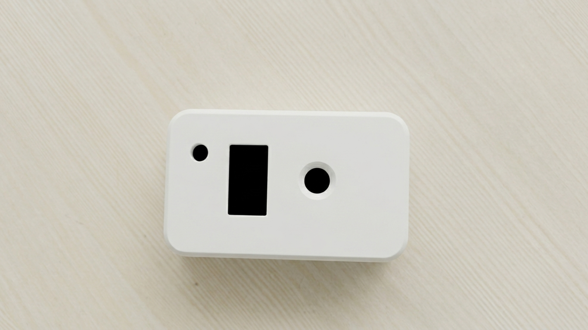
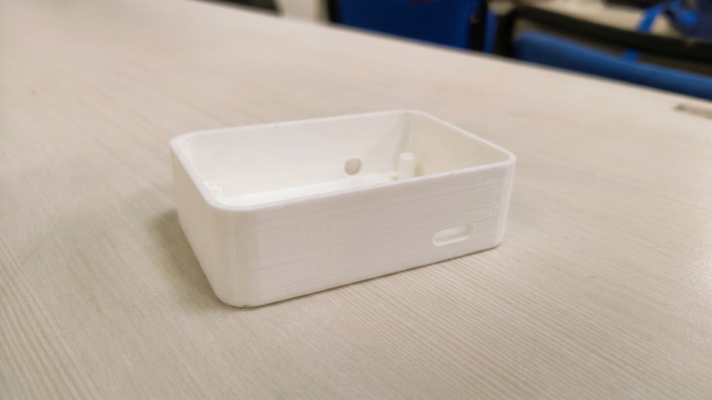

# 🫀 Smart Posture & Heart Rate Monitor

A 3D-modeled enclosure designed for my Smart Personal Health & Posture Monitoring System.

The body was designed in Blender with the electronic components and physical assembly in mind, and was successfully 3D printed as a physical prototype.

## Project Focus

* 3D enclosure design
* Hard-surface modeling
* Component placement
* Physical dimensions and fit
* 3D-printable design
* Assembly-focused modeling

## Features

* Compact enclosure for the electronics
* Designed around the project's hardware
* Openings for required components
* Separate body sections for assembly
* Designed for practical 3D printing

## Software

* Blender
* Cura

## Status

🟢 **Completed & 3D Printed**

This project was designed in Blender and successfully converted into a physical 3D-printed enclosure for the monitoring system.

## Blender Design

The enclosure was designed in Blender with the electronics and physical assembly requirements in mind.

## 3D Printed Result

The final enclosure was successfully 3D printed and assembled as a physical prototype.

